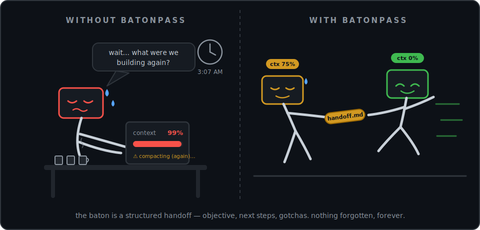

<div align="center">

# batonpass

**Automatic session handoff for coding agents — never hit a context limit again.**
Watches a running agent session, has the agent write its own handoff before context runs out, then respawns a fresh session that picks up exactly where the old one left off.

[](https://github.com/Roizlotolov/batonpass/actions/workflows/ci.yml)
[](LICENSE)
[](package.json)
[](pnpm-workspace.yaml)
[](CONTRIBUTING.md)

for [Claude Code](https://code.claude.com) · [Codex CLI](https://developers.openai.com/codex)



</div>

## Install

```sh
git clone https://github.com/Roizlotolov/batonpass.git
cd batonpass
pnpm install && pnpm build
```

That's the whole prerequisite (Node ≥22 + pnpm). `node-pty` has a native
addon — if `pnpm install` fails you're missing a C++ toolchain (Xcode
command line tools on macOS, `build-essential` on Linux).

Once published to npm this becomes just `npm i -g batonpass` — see
[Status](#status).

## Quick start

Pick your agent.

### Claude Code

```sh
node packages/cli/dist/index.js init          # installs hooks + statusline in this project
node packages/cli/dist/index.js run claude    # spawns `claude` under the orchestrator
```

### Codex CLI

```sh
node packages/cli/dist/index.js init --agent codex
node packages/cli/dist/index.js run codex
```

Use `--agent all` to set up both, `--user` to install once for every project
on your machine, `--uninstall` to cleanly remove. Then just work normally —
at 75% context the agent writes its handoff and a fresh session takes over
automatically. Trigger one manually anytime with `/handoff` inside the
session.

> Windows: the Claude Code path is untested and the Codex adapter refuses to
> install (Codex hooks require a POSIX shell).

## The problem

Long agent sessions degrade. As the context window fills:

1. **Built-in auto-compaction is lossy** — the tool summarizes your session
   with an external pass that doesn't know which details are load-bearing,
   and the agent silently starts "forgetting" decisions it already made.
2. **The manual workaround doesn't scale** — people end up asking the agent
   to "write handoff notes," restarting the CLI by hand, and pasting the
   notes back in. Every few hours. Forever.

Batonpass automates that whole loop, and does it better than compaction can:
**the agent itself writes the handoff** — it knows what actually matters —
into a structured, validated, on-disk format that works identically across
tools.

## How it works

```
watch usage ──► threshold hit ──► wait for turn-idle ──► inject handoff prompt
     ▲                                                          │
     │                                                          ▼
respawn fresh session ◄── kill old session ◄── validate handoff artifact
     │
     └── SessionStart hook injects the handoff as initial context … repeat forever
```

1. `batonpass run claude` (or `codex`) spawns the agent CLI inside a PTY and
   proxies your keystrokes — you use the agent exactly as before.
2. Batonpass watches context usage (statusline data for Claude Code, rollout
   JSONL for Codex).
3. At a threshold (default **75%**), once the current turn is idle, it
   injects a prompt asking the agent to write a structured handoff document.
4. The artifact is validated against the [spec](docs/spec.md). Only after a
   **valid handoff exists on disk** does Batonpass kill the session and spawn
   a fresh one, with the handoff injected as initial context via a
   `SessionStart`-equivalent hook.
5. Repeat indefinitely — chained handoffs, zero manual intervention, full
   history in `.batonpass/handoffs/`.

**Safety first:** Batonpass never kills a session without a validated
artifact already on disk. If the agent writes an invalid handoff it retries
once with a corrective prompt; if that still fails, it leaves the session
running and prints instructions instead of destroying in-flight work. On
Claude Code it also blocks the built-in auto-compaction (via `PreCompact`)
while the orchestrator is running, so the two mechanisms never fight.

## What a handoff looks like

Every handoff is a directory under `.batonpass/handoffs/` containing a
machine-readable `handoff.json` (seq, tool, session ID, git HEAD, context %
at handoff, link to the previous handoff in the chain) and an agent-written
`handoff.md` with eight required sections:

```md
# Handoff 3

## Objective            ← the overall task; survives the whole chain verbatim
## Current state        ← DONE vs. in-progress, concretely
## Next steps           ← ordered; item 1 is the exact next action with file paths
## Key decisions        ← decisions + WHY, so the next session doesn't relitigate
## Files touched        ← path -> one-line description
## Gotchas & constraints
## Verification         ← exact commands to confirm current state
## Do NOT               ← explicit anti-instructions for the next session
```

A handoff is only valid if every section is present and non-empty. The format
is [specified](docs/spec.md) and versioned independently of the CLI so other
tools can read/write it without depending on this repo.

## Status

Early development (v0.1). **Not yet published to npm** — this repo has not
been through a real release. The orchestrator is proven end-to-end in CI
against a deterministic fake agent (3 fully automatic chained handoffs,
spawn→watch→inject→validate→kill→respawn), but has **not yet been manually
verified against the real `claude`/`codex` binaries** — see
[docs/testing.md](docs/testing.md) for the exact remaining checklist before
you should rely on it. [PLAN.md](PLAN.md) has the full implementation plan
and a running progress log.

## Commands

| Command | What it does |
|---|---|
| `batonpass run <claude\|codex>` | The orchestrator: spawns the agent CLI and manages the full handoff lifecycle. |
| `batonpass init [--agent claude\|codex\|all] [--project\|--user] [--uninstall]` | Install (or remove) hooks/statusline for an agent. |
| `batonpass status` | Current orchestrator/session state for this project. |
| `batonpass handoffs [show <seq>]` | List handoffs, or print one. |
| `batonpass doctor` | Check agent binaries, hook installation, and known platform caveats. |

You can also trigger a handoff manually at any time with `/handoff` inside
the agent session — useful for a clean end-of-day checkpoint even when
context isn't full.

## Architecture

```
┌─────────────────────────────────────────────────────────────┐
│ batonpass CLI (packages/cli — node-pty wrapper)              │
│  • spawns agent CLI in a PTY, proxies stdin/stdout           │
│  • watches context usage (statusline file / rollout JSONL)   │
│  • at threshold + turn-idle: injects the handoff prompt      │
│  • waits for a validated artifact → kills → respawns         │
└───────────────┬─────────────────────────────────────────────┘
                │ reads/writes
        ┌───────▼────────┐        ┌───────────────────────────┐
        │ .batonpass/    │◄───────┤ hooks (per adapter)        │
        │  state.json    │        │  SessionStart: inject      │
        │  handoffs/*.md │        │  Stop: turn-idle signal    │
        │  usage.json    │        │  PreCompact (Claude only): │
        └────────────────┘        │  blocks auto-compaction    │
                                  └───────────────────────────┘
```

The orchestrator knows nothing about any specific agent CLI — it only calls
methods on an `Adapter` interface. Adding support for a new tool (OpenClaw,
Hermes, OpenCode, …) means writing one adapter package — see
[docs/adapters.md](docs/adapters.md); contributions welcome.

### Packages (monorepo)

```
packages/
├── core/                  @batonpass/core — handoff schema/validation, .batonpass/ state,
│                          prompt templates, usage parsers for both tools
├── adapter-claude-code/   @batonpass/adapter-claude-code — Claude Code hooks + statusline + install
├── adapter-codex/         @batonpass/adapter-codex — Codex CLI hooks + config.toml install
└── cli/                   batonpass (bin: batonpass) — the orchestrator + commander CLI
examples/
└── fake-agent/            deterministic stand-in CLI for e2e-testing without a real agent
```

## Verification methodology

Both Claude Code's and Codex CLI's hook systems are explicitly marked
experimental upstream and change between versions, so every adapter fact in
this repo (hook names, stdin payload shapes, config file mechanics) was
verified against the tools' **current live documentation** during
implementation — not cached model knowledge — and the re-verification log
lives in [PLAN.md](PLAN.md). The test suite follows the same philosophy:

- Every hook script is tested by invoking it as a **real child process** with
  recorded stdin fixtures — not by unit-testing helpers in isolation.
- The full orchestrator lifecycle is proven end-to-end through a **real
  `node-pty`** against a deterministic fake agent: 3 chained automatic
  handoffs, lock-file exclusivity between two orchestrators, path-traversal
  rejection on tampered state, and a 5-cycle drift test proving the
  Objective section survives write→read→re-render verbatim.

What's automated vs. what still needs a human with real CLIs installed is
tracked honestly in [docs/testing.md](docs/testing.md).

## Docs

- [docs/spec.md](docs/spec.md) — the handoff artifact format (versioned
  separately from the CLI; this is the part other tools should adopt).
- [docs/adapters.md](docs/adapters.md) — the `Adapter` interface and how to
  write a new one.
- [docs/testing.md](docs/testing.md) — what's automated vs. what still needs
  manual verification against real `claude`/`codex` CLIs before a release.
- [PLAN.md](PLAN.md) — full implementation plan + running progress log.

## Development

```sh
pnpm install
pnpm build
pnpm test    # vitest: unit + hook-script integration + PTY e2e (no real agent, API key, or network needed)
pnpm lint
```

Node 22 or 24 (pnpm 11 requires Node ≥22.13). CI runs the full matrix
(ubuntu/macos × node 22/24) on every
push and PR — see [.github/workflows/ci.yml](.github/workflows/ci.yml).
Releases are driven by [changesets](https://github.com/changesets/changesets):
merging the auto-generated "Version Packages" PR publishes to npm.

## Contributing

Issues and PRs welcome — see [CONTRIBUTING.md](CONTRIBUTING.md) for the
ground rules (the short version: verify adapter facts against the real CLI's
current docs, test hook scripts as real child processes, and add a
changeset). New adapters are the most valuable contribution — see
[docs/adapters.md](docs/adapters.md). This project follows the
[Contributor Covenant](CODE_OF_CONDUCT.md). Security issues: see
[SECURITY.md](SECURITY.md).

## License

[MIT](LICENSE)
